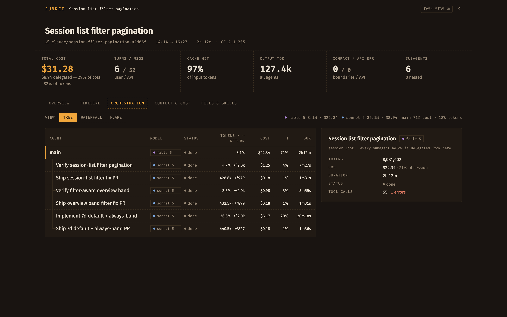
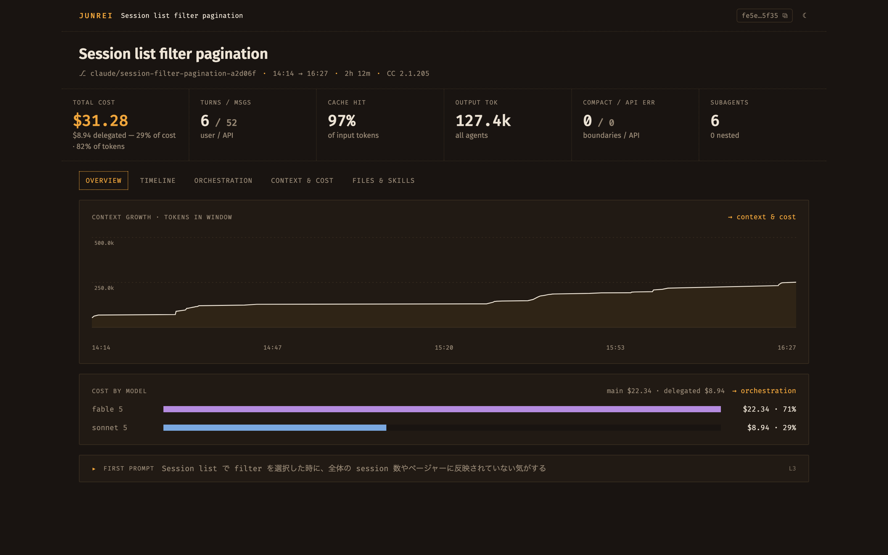
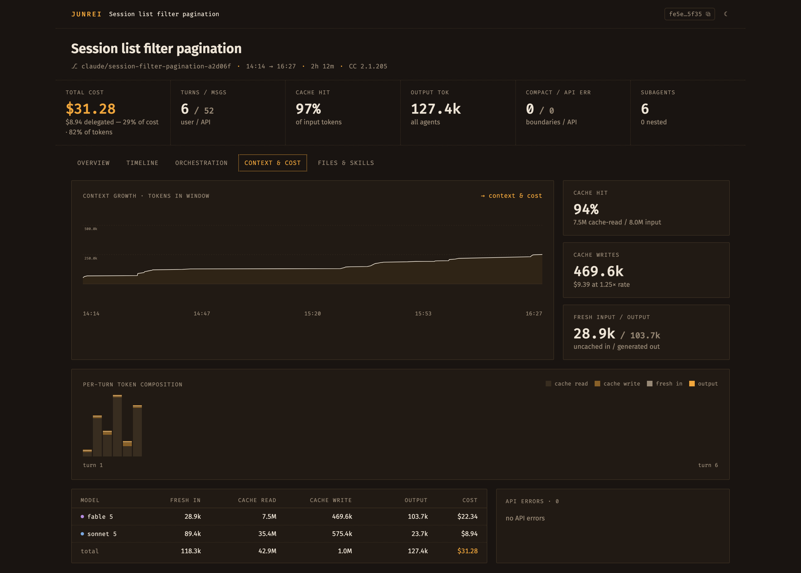

# Junrei

**Zero-config self-improvement-loop infrastructure for Claude Code and Codex**
— a local-first tool that turns your existing session logs into quantitative,
reproducible observations, and closes the loop between what the agents cost and
what you change about it.

Junrei (巡礼, "pilgrimage") walks a session's route again after the fact and
shows where the tokens, dollars, and time actually went. It parses session logs
from Claude Code and Codex CLI and computes **logic-derived quantitative data
only** — token/cost accounting, context growth, tool success rates, subagent
orchestration, repetition detection, and more — then drives an
agent-runnable improvement loop over it: **Measure** (a conclusion-first
briefing) → **Learn** (record a fix as a committable *learning*) → **Change**
(apply it) → **Verify** (a computed before/after). There is no LLM judgment or
scoring anywhere in the pipeline; even the ranked `waste` and `recommendations`
are deterministic, provenance-attached, templated fixes, not evaluations.
Interpreting the numbers — and deciding what to change — is left to humans, or
to the agents consuming them over MCP.



*A real Junrei session, viewed in Junrei — the orchestration lens breaking
down cost and delegation across a main agent and its subagents.*

## Features

- **Two sources, one model** — Claude Code and Codex CLI sessions (including
  subagents) are normalized into the same shape and shown side by side.
- **Cost & token accounting** — per-model usage and estimated USD cost, with a
  main-thread-vs-subagents delegation split.
- **Context timeline** — effective context size per API message, plus
  compaction events.
- **Orchestration tree** — subagent/sub-agent nesting, per-node cost, and
  tool call/error counts.
- **Repetition detection** — consecutive identical tool calls, repeated
  file reads, repeated failing calls (Claude Code sessions).
- **Files & skills** — file access tree, skill invocations, tool stats, and
  task executions.
- **Briefing & the learnings loop** — a conclusion-first "morning paper" per
  repo (dollar-ranked waste, wins, deltas) and a repo-local, git-committable
  **learnings ledger** (`.junrei/learnings/`) driving a Measure → Learn →
  Change → Verify loop with a computed before/after check.
- **Web UI** — three views (Briefing / Sessions / Learnings) plus a per-session
  detail with Story / Orchestration / Evidence lenses.
- **MCP server** — a six-tool self-improvement loop (plus two opt-in
  diagnostics) so a coding agent can diagnose its own (or another session's)
  activity and record fixes directly.
- **Evaluation trace export** — merge the session log with OTel/wire-capture
  (when enabled) into one normalized, provenance-carrying event trace for
  external eval pipelines or LLM-judges (the opt-in `export_trace` diagnostic /
  `GET .../evaluation-trace`), plus a bundled skill encoding an evidence-grade
  session-analysis methodology.

## Quick start

Requirements are pinned in `aqua.yaml` (Node.js, `pnpm`, `gh`) and managed via
[aqua](https://aquaproj.github.io/):

```sh
aqua i -l
pnpm install
```

Start the app with fixed ports:

```sh
pnpm start
```

- Web UI: http://localhost:5873 (override with `JUNREI_WEB_PORT`)
- API server: http://localhost:7867 (override with `JUNREI_PORT`;
  `JUNREI_SERVER_PORT` is accepted as an alias)
- MCP endpoint: http://localhost:7867/mcp

For local development, `pnpm dev` instead searches upward from port 7868
(API) and 5874 (Web) for the first free ports, and prints the resolved Web,
API, and MCP URLs at startup. Both commands run the API server and web UI
with hot reload enabled.

## Web UI

Three top-level views, plus a per-session detail. Every number the UI shows
traces to one server response — the client never re-aggregates.

**Briefing** (`/`) — the home: a conclusion-first "morning paper" for a repo
(or all repos) over a 1/7/30-day window. A KPI delta strip (cost, waste $ and %,
delegation share, cache hit, learnings open/applied/verified), a dollar-ranked
WASTE feed (each item with a copy-ready fix, a provenance session link, and a
Log-learning button), a LEARNINGS panel, a WINS panel, and a footer cost
sparkbar — all straight off `GET /api/briefing`. `/trends` now redirects here.

**Sessions** (`/sessions`) — every session from either source in one table,
with tabs to filter by source (all / Claude Code / Codex), a title search box,
a repo filter, and a date filter (last 7/14/30 days, or all time; last 7 days by
default). Results are paginated.

**Learnings** (`/learnings`) — the loop board: a MEASURE (briefing's waste feed)
→ LEARN (open learnings) → CHANGE (applied, awaiting data) → VERIFY (verified /
rejected, with before/after) pipeline over the repo-local ledger, with a
loop-health strip. Accept / Dismiss / Log-learning all POST the same upsert the
`log_learning` MCP tool runs.

**Session detail** opens into three lenses:

- **Story** — a conclusion-first FROM-THIS-SESSION insight callout (headline
  cost/delegation read plus ranked recommendations, each with a Log-learning
  button) above the record-by-record Timeline (filters, a turn-aware mini-map,
  and a per-turn table that expands in place).
- **Orchestration** — the subagent tree, as a tree, waterfall, or flame view,
  with a per-model cost × return-size delegation summary.
- **Evidence** — the drill-down, in three sub-tabs: **Context** (context growth,
  compactions, per-model cost), **Files & skills** (file access, skill
  invocations, tool stats, repetitions, task executions), and **Tools**
  (cross-tool usage — **All** ranks every tool by estimated cost with a source
  split, an errors-by-tool × category matrix, money attribution, and heavy
  hitters; **Bash** is per-command Bash detail: rankings, a fix queue, and heavy
  hitters, and where the old standalone `/bash` links land). Internal ids (line
  numbers, `tool_use_id`) are exposed only here.

Subagents are drillable: opening one reuses the same lens set, scoped to that
subagent's own transcript.



*Top-line cost, cache hit rate, and context growth at a glance — the numbers
the Story lens headlines and the Evidence › Context sub-tab charts.*



*Evidence › Context — context growth over time plus cache economics and
per-turn token composition.*

## MCP server

Register Junrei's MCP endpoint in Claude Code with:

```sh
claude mcp add --transport http junrei http://localhost:7867/mcp
```

The surface is a six-tool self-improvement loop plus two opt-in diagnostics
(not a 1:1 dump of the data model). Table order matches registration order in
`packages/server/src/mcp.ts`. The bundled
[`junrei-session-analysis` skill](.claude/skills/junrei-session-analysis/SKILL.md)
encodes the loop order, the provenance-citation rule, and truncation handling.

**Core loop** — always registered:

| Tool | Purpose | Source support |
| --- | --- | --- |
| `briefing` | START HERE. Conclusion-first roll-up of a repo (or all repos) over `days`: a period `summary` with previous-window deltas, a dollar-ranked `waste[]` (each with a copy-ready `fix` + provenance), `wins[]`, the learning-ledger standing, `dailyCosts[]`, and `topSessions`. | Claude Code + Codex |
| `analyze_session` | The why for one session: `summary`, `costDrivers[]`, the same `waste[]` shape, a `delegation` health read, and `recommendations[]` (each with a ready-to-submit `logLearningCall`). | Claude Code + Codex (Codex marks `repetitions`/`taskExecutions` `notAvailable`) |
| `find_patterns` | Cross-session search — `kind: 'text'` (full-text), `'delegation'` (group by subagent-count × model-mix shape, with each shape's avg cost / return size), or `'waste'` (roll up waste findings by class). | Claude Code + Codex |
| `get_evidence` | The drill-down through one `select` shape: `record` (a JSONL line), `tool_call` (call+result by `toolUseId`), `tool_calls` (a filterable listing to discover an id), `first_prompt`, or `task_executions`. An unsupported kind returns `notAvailable`, never an error. | Claude Code + Codex (`task_executions` Claude only) |
| `log_learning` | Upsert a learning into the repo-local ledger (`<repoRoot>/.junrei/learnings/`) — create (`finding` + `change`) or update (`id` + `status`/`verification`). The only tool that writes a learning. | Claude Code + Codex |
| `review_learnings` | Read-only listing of a repo's `open` + `applied` learnings, each applied one carrying a COMPUTED before/after comparison (cost/day, delegation share, cache hit, Bash spend) around its `appliedAt` — never persisted. | Claude Code + Codex |

**Diagnostics** — registered only under `JUNREI_DIAGNOSTICS=1`, Claude Code only:

| Tool | Purpose | Source support |
| --- | --- | --- |
| `inspect_wire` | `mode: 'reconstructed'` (rebuild a `/v1/messages` payload from the log with per-block confidence classes), `'actual'` (the captured wire request/response for a `requestId` — opt-in wire capture, measured latency), or `'hidden'` (captured calls whose `requestId` never appears in the log — structural cost-undercount evidence). | Claude Code only |
| `export_trace` | Export a session as one normalized `junrei-evaluation-trace/v1` document (`gen_ai.*`/`junrei.*` events; OTel/wire-capture enrichment when opted in) for external eval pipelines or LLM-judges. `GET /api/sessions/claude-code/:id/evaluation-trace` returns the same trace uncapped. | Claude Code only |

## How it works

By default there is nothing to configure: Junrei discovers each agent's local
session logs and reads them in place — nothing is sent anywhere:

- **Claude Code**: `~/.claude/projects/**/*.jsonl` (or `CLAUDE_CONFIG_DIR`),
  plus subagent sidecar transcripts and a join against the Desktop app's
  local session-title store.
- **Codex CLI**: `$CODEX_HOME/sessions/**/*.jsonl` and
  `$CODEX_HOME/archived_sessions/`, with sub-agents resolved as their own
  linked session files.

Optionally, Claude Code sessions can also be read directly from an S3 bucket
— e.g. a remote environment (Claude Agent SDK on AWS AgentCore Runtime)
uploading transcripts that mirror the local `~/.claude/projects/` layout.
This is opt-in and off by default:

- `JUNREI_S3_SOURCE_URI` — an `s3://bucket/` or `s3://bucket/prefix/` URI.
  When set, Junrei lists and reads Claude Code sessions from that bucket
  in addition to local sessions, merged into the same session list (no
  local sync/mirror). Unset, behavior is unchanged.
- `JUNREI_S3_ENDPOINT` — optional custom S3 endpoint (e.g. for MinIO,
  LocalStack, or kumo); also enables path-style addressing. Region and
  credentials are resolved via the AWS SDK's default chain.
- `JUNREI_S3_LIST_TTL_MS` — how long the S3 object listing is cached before
  a fresh `ListObjectsV2` sweep, in milliseconds (default `10000`).

### OTel ingestion (opt-in)

Junrei can also ingest Claude Code's own OpenTelemetry export — an
authoritative side channel Claude Code sends for observability, separate
from (and carrying different information than) the session JSONL. This is
opt-in and off by default; with it unset, Junrei's behavior is completely
unchanged:

- `JUNREI_OTEL_DIR` — an absolute directory path. When set, the junrei
  server accepts OTLP/HTTP JSON POSTs at `/otlp/v1/logs` and
  `/otlp/v1/metrics` and stores them as one JSONL file per Claude Code
  `session.id` under this directory (`_unassigned.jsonl` for any record
  whose session id couldn't be resolved). Unset, those routes don't exist —
  a request to them 404s exactly like any other unknown route.

On the Claude Code side, point its OTel exporters at the junrei server:

```sh
export OTEL_LOGS_EXPORTER=otlp
export OTEL_METRICS_EXPORTER=otlp
export OTEL_EXPORTER_OTLP_PROTOCOL=http/json
export OTEL_EXPORTER_OTLP_ENDPOINT=http://localhost:7867/otlp
```

Once both sides are configured, the `get_session_observability` MCP tool
returns authoritative billing-computed cost (`costBasis: "otel"`) alongside
the usual pricing-table estimate (`costBasis: "pricing-table-estimate"`) and
their delta, per-`api_request` latency stats, `tool_decision`
(permission accept/reject) events, and MCP/hook health events — none of
which the session JSONL carries. OTel carries no prompt or tool content at
all (no user/assistant text, no tool arguments/results, no system prompt or
schemas) — it's a pure ops/billing channel, never a content source.
Retention of `JUNREI_OTEL_DIR`'s contents is user-managed; Junrei never
deletes what it wrote there.

Architecture (pnpm workspace):

- `packages/core` — parsers and metric computation for both sources, plus the
  bundled cost model.
- `packages/server` — a Hono REST API and the Streamable HTTP MCP endpoint
  (`/mcp`); serves the built web UI in production.
- `packages/web` — the Vite + React single-page app.

Costs are **estimates**: list-price rates from a bundled snapshot of
LiteLLM's `model_prices_and_context_window.json`, multiplied by observed
token counts (including tiered >200k and 5m/1h cache pricing where
applicable). They are not your actual bill.

## Wire capture (opt-in, local-only)

The session log is a lossy record: it never captures per-request latency, and
some background API calls (e.g. a task-state classifier) are invisible to it,
so log-based cost accounting structurally undercounts. **Wire capture** closes
that gap by recording the actual API traffic — but it is strictly opt-in and
runs only on your own machine.

`junrei-capture-proxy` is a tiny localhost pass-through proxy. It binds
`127.0.0.1` **only** (never a public interface), forwards every request to
`https://api.anthropic.com` unchanged (SSE streams through untouched), and tees
a copy of each exchange to `~/.junrei/captures/<sessionId>.jsonl`.

**Security / ToS — read before enabling:**

- It captures your **full API traffic, including prompt contents**. Treat the
  files under `~/.junrei/captures/` as **sensitive**: never commit or share
  them.
- **Auth headers are redacted at write time** — `authorization`, `x-api-key`,
  cookies, and any header whose name contains `token`/`secret` are replaced
  with `[redacted]` before anything touches disk. The pass-through to the API
  stays byte-faithful; only the stored copy is redacted.
- For Anthropic **subscription (OAuth)** accounts, routing traffic through a
  local proxy sits in a **documented ToS gray zone** (see
  [docs/milestones/goshuin.md](docs/milestones/goshuin.md)) — it is entirely
  your own local, opt-in choice. **API-key** usage carries no such caveat.
- **Retention is user-managed**: delete `~/.junrei/captures` anytime.

Setup — start the proxy, then point a Claude Code session at it:

```sh
pnpm capture
# then, in another shell, run Claude Code through the proxy:
ANTHROPIC_BASE_URL=http://localhost:7967 claude
```

The proxy prints a full banner (including the exact `ANTHROPIC_BASE_URL` line)
on startup. Override the port with `--port`, the captures dir with `--dir` (or
`JUNREI_CAPTURES_DIR`), and the upstream with `--upstream`.

Once captures exist, two MCP tools read them (joined to the session log by the
same `requestId` the log records):

- **`get_actual_request(sessionRef, requestId)`** — the captured wire request
  body, response meta (status/model/usage), **measured** `latencyMs`, and
  `isSubagent` for that request.
- **`get_hidden_calls(sessionRef)`** — the captured requests whose `requestId`
  never appears in the session log: the concrete evidence of undercounted
  cost/latency (each call's content is fetched via `get_actual_request`).

Captures also serve as the **calibration ground truth** for the reconstruction
layer (`get_reconstructed_request`): whenever a capture exists for a session,
reconstruction accuracy is measured against the real wire bytes rather than
assumed (see `experiments/claude-code-capture/recon/`).

## Development

`aqua.yaml` references a local (non-standard) registry (`aqua/kumo-registry.yaml`,
for the `kumo` S3-compatible test server) — aqua v2 requires trusting it once
before `aqua i -l` will install from it:

```sh
aqua policy allow aqua-policy.yaml
```

CI does the non-interactive equivalent via aqua-installer's `policy_allow`
input, so this is a one-time local step only.

```sh
aqua i -l
pnpm install
pnpm typecheck && pnpm lint && pnpm test
```

`build`, `typecheck`, and `test` are orchestrated by
[Turborepo](https://turborepo.dev) (`turbo.json`) for task ordering and local
caching across the workspace; `pnpm dev`/`pnpm start` are unaffected and keep
using the launcher scripts above. Linting/formatting is via Biome; tests run
each package's vitest suite plus a launcher `node --test` suite and skill
validation. CI runs the same gates.

See [docs/design.md](docs/design.md) (technical design + the v3 concept: the
agent self-improvement loop, MCP-first principles, the learnings ledger, and the
G1–G5 gates), [docs/concept.md](docs/concept.md) (the earlier v2 concept &
signal model), and [docs/roadmap.md](docs/roadmap.md) (feature history/status)
for more.

## License

MIT
